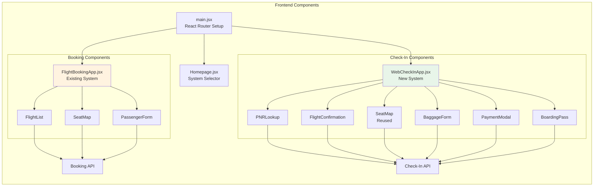
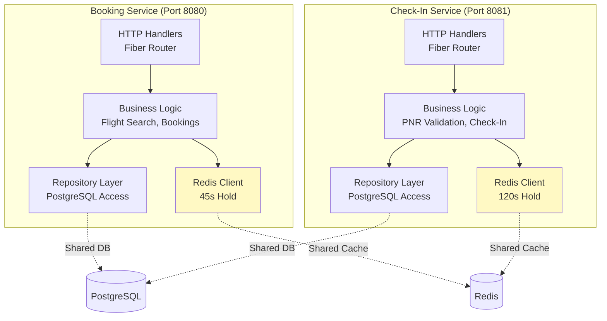
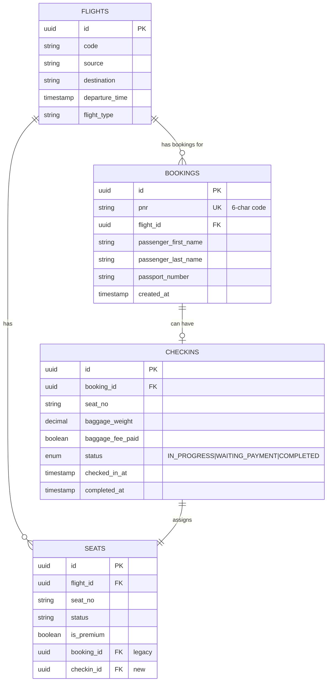
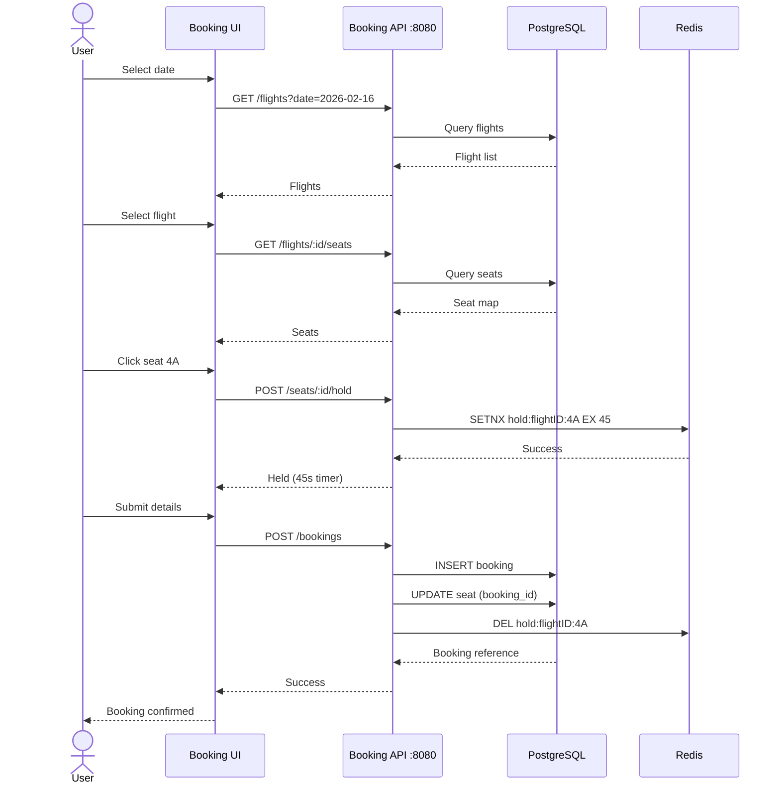
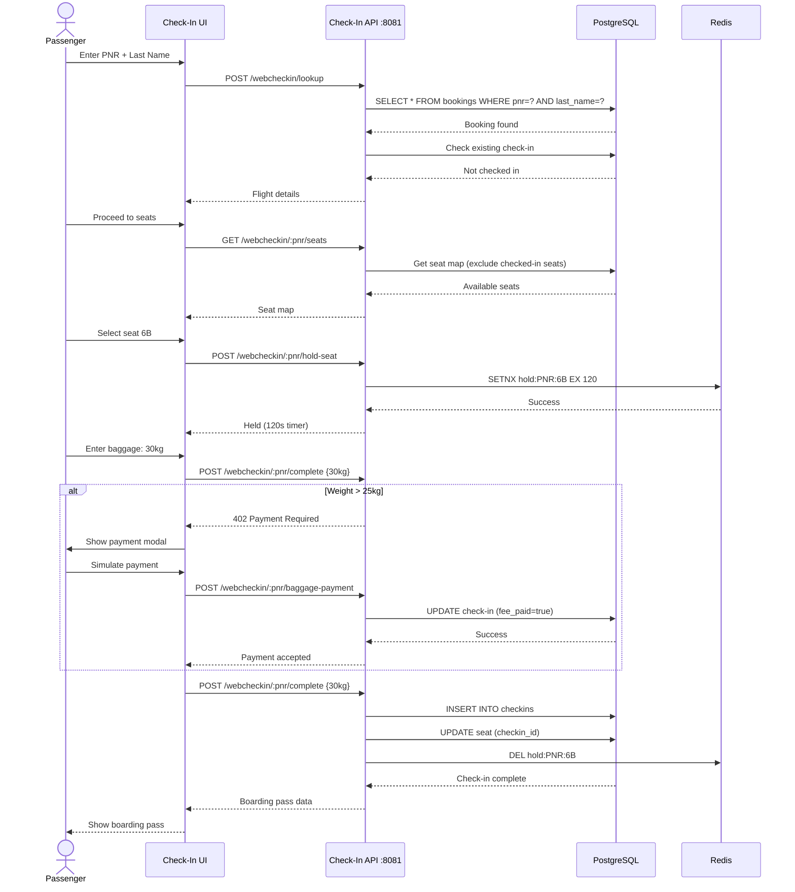
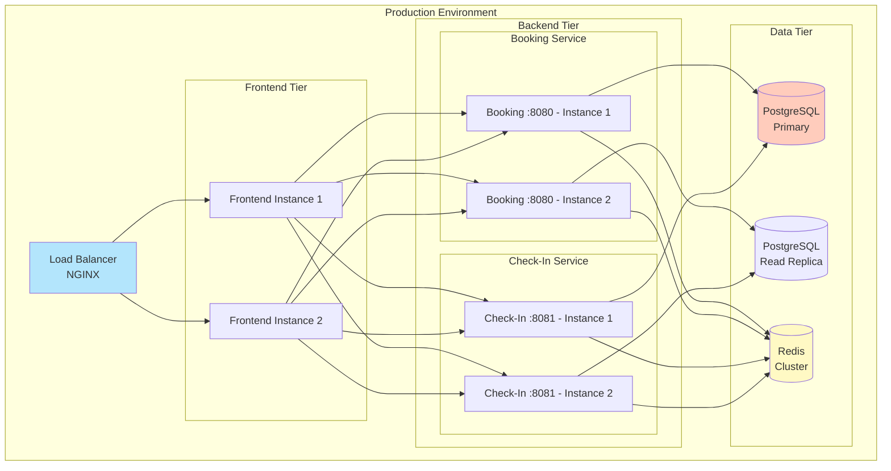
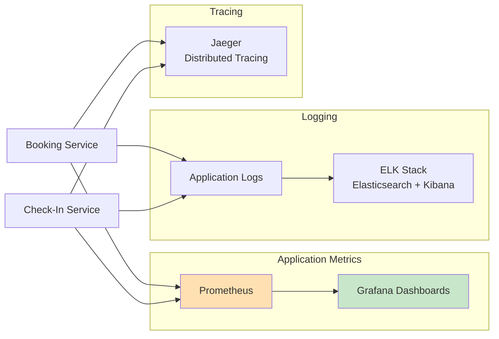

# System Architecture - Digital Check-In System

> **Version**: 2.0 (Dual System Architecture)  
> **Last Updated**: 2026-02-16

---

## System Overview

The Digital Check-In System now consists of **two independent subsystems** running on separate routes, sharing common infrastructure.

---

## High-Level Architecture

```mermaid
graph TB
    subgraph "User Interface (Frontend - React)"
        direction TB
        Browser[Web Browser]
        
        subgraph "Route: /"
            Home[Homepage Component<br/>System Selector]
        end
        
        subgraph "Route: /flight-booking-system"
            BookingUI[Flight Booking UI<br/>Date Picker → Flight List → Seat Map]
        end
        
        subgraph "Route: /web-check-in"
            CheckInUI[Web Check-In UI<br/>PNR Lookup → Seat Selection → Boarding Pass]
        end
    end
    
    subgraph "Backend Services (Go + Fiber)"
        direction LR
        
        subgraph "Booking Service :8080"
            BookingAPI[Flight Booking API<br/>- Search Flights<br/>- Book Tickets<br/>- Seat Management]
        end
        
        subgraph "Check-In Service :8081"
            CheckInAPI[Web Check-In API<br/>- PNR Lookup<br/>- Seat Hold (120s)<br/>- Complete Check-In]
        end
    end
    
    subgraph "Data Layer"
        direction TB
        
        DB[(PostgreSQL<br/>- Flights<br/>- Seats<br/>- Bookings<br/>- CheckIns)]
        
        Cache[(Redis<br/>- Seat Holds<br/>- TTL: 45s (booking)<br/>- TTL: 120s (check-in))]
    end
    
    Browser --> Home
    Home -->|Book Flight| BookingUI
    Home -->|Check-In| CheckInUI
    
    BookingUI --> BookingAPI
    CheckInUI --> CheckInAPI
    
    BookingAPI --> DB
    BookingAPI --> Cache
    CheckInAPI --> DB
    CheckInAPI --> Cache
    
    style Home fill:#e3f2fd
    style BookingUI fill:#fff3e0
    style CheckInUI fill:#e8f5e9
    style BookingAPI fill:#fff3e0
    style CheckInAPI fill:#e8f5e9
```

---

## Component Details

### Frontend Architecture



### Backend Microservices



---

## Database Schema

### Entity Relationship Diagram



---

## Data Flow

### Flight Booking System (Existing)



### Web Check-In System (New)



---

## Infrastructure

### Docker Compose Configuration

```yaml
version: '3.8'

services:
  # Existing booking service
  booking-service:
    build: ./backend
    ports:
      - "8080:8080"
    environment:
      - DB_HOST=postgres
      - REDIS_HOST=redis
    depends_on:
      - postgres
      - redis
  
  # New check-in service
  checkin-service:
    build: ./backend_webcheckin
    ports:
      - "8081:8081"
    environment:
      - DB_HOST=postgres
      - REDIS_HOST=redis
    depends_on:
      - postgres
      - redis
  
  # Frontend (serves both systems)
  frontend:
    build: ./frontend
    ports:
      - "5173:5173"
    depends_on:
      - booking-service
      - checkin-service
  
  # Shared PostgreSQL
  postgres:
    image: postgres:15-alpine
    environment:
      POSTGRES_DB: skyhigh
      POSTGRES_USER: admin
      POSTGRES_PASSWORD: password
    volumes:
      - postgres_data:/var/lib/postgresql/data
  
  # Shared Redis
  redis:
    image: redis:7-alpine
    ports:
      - "6379:6379"

volumes:
  postgres_data:
```

---

## Technology Stack

| Layer | Technology | Version | Purpose |
|-------|-----------|---------|---------|
| **Frontend** | React | 18.x | UI framework |
| | React Router | 6.x | Client-side routing |
| | TailwindCSS | 3.x | Styling |
| | Vite | 5.x | Build tool |
| **Backend** | Go | 1.21+ | Primary language |
| | Fiber | 2.x | HTTP framework |
| | GORM | 1.x | ORM |
| **Database** | PostgreSQL | 15.x | Relational data |
| | Redis | 7.x | Caching & seat holds |
| **DevOps** | Docker | 24.x | Containerization |
| | Docker Compose | 2.x | Orchestration |

---

## Deployment Architecture



---

## Security Considerations

| Concern | Mitigation |
|---------|------------|
| **PNR Enumeration** | Rate limiting (5 attempts/minute/IP) |
| **SQL Injection** | GORM parameterized queries |
| **XSS** | React auto-escaping, CSP headers |
| **CORS** | Whitelist frontend origin only |
| **Seat Hold Abuse** | Redis TTL enforcement, IP-based limits |
| **Payment Fraud** | Simulated for MVP, integrate payment gateway for production |

---

## Monitoring & Observability



**Key Metrics to Monitor:**
- Request latency (P50, P95, P99)
- Seat hold expiry rate
- Check-in completion rate
- Database connection pool usage
- Redis memory usage
- Error rates by endpoint

---

## Scalability Considerations

### Horizontal Scaling
- **Frontend**: Stateless, scale to N instances behind load balancer
- **Backend Services**: Stateless, scale independently based on load
- **Database**: Read replicas for GET requests, primary for writes
- **Redis**: Cluster mode for high availability

### Performance Optimization
- **Seat Map Caching**: Cache seat maps in Redis (1-minute TTL)
- **Database Indexing**: 
  - `bookings(pnr)` - For fast PNR lookup
  - `checkins(booking_id)` - For check-in status queries
  - `seats(flight_id, status)` - For seat availability
- **Connection Pooling**: Max 50 connections per service instance

---

## Disaster Recovery

| Scenario | Recovery Strategy | RTO | RPO |
|----------|------------------|-----|-----|
| Database Failure | Failover to replica | 30s | 0 (synchronous replication) |
| Redis Failure | Rebuild holds from DB | 1min | 0 (seats in DB) |
| Service Crash | Auto-restart (Docker) | 10s | 0 |
| Data Center Outage | Multi-region deployment | 5min | 1min |

---

## Future Enhancements

1. **Real Payment Integration**: Stripe/PayPal for baggage fees
2. **Mobile Apps**: React Native iOS/Android apps
3. **Boarding Pass PDF**: Generate downloadable PDFs
4. **Email Notifications**: Send boarding pass via email
5. **SMS Reminders**: Check-in reminders 24h before flight
6. **Kiosk Mode**: Dedicated UI for airport kiosks
7. **Admin Dashboard**: Monitor check-ins, override holds

---

**Document Version**: 2.0  
**Last Review**: 2026-02-16  
**Next Review**: 2026-03-01
