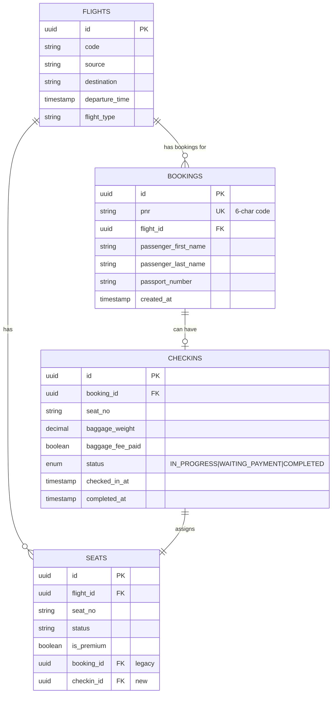
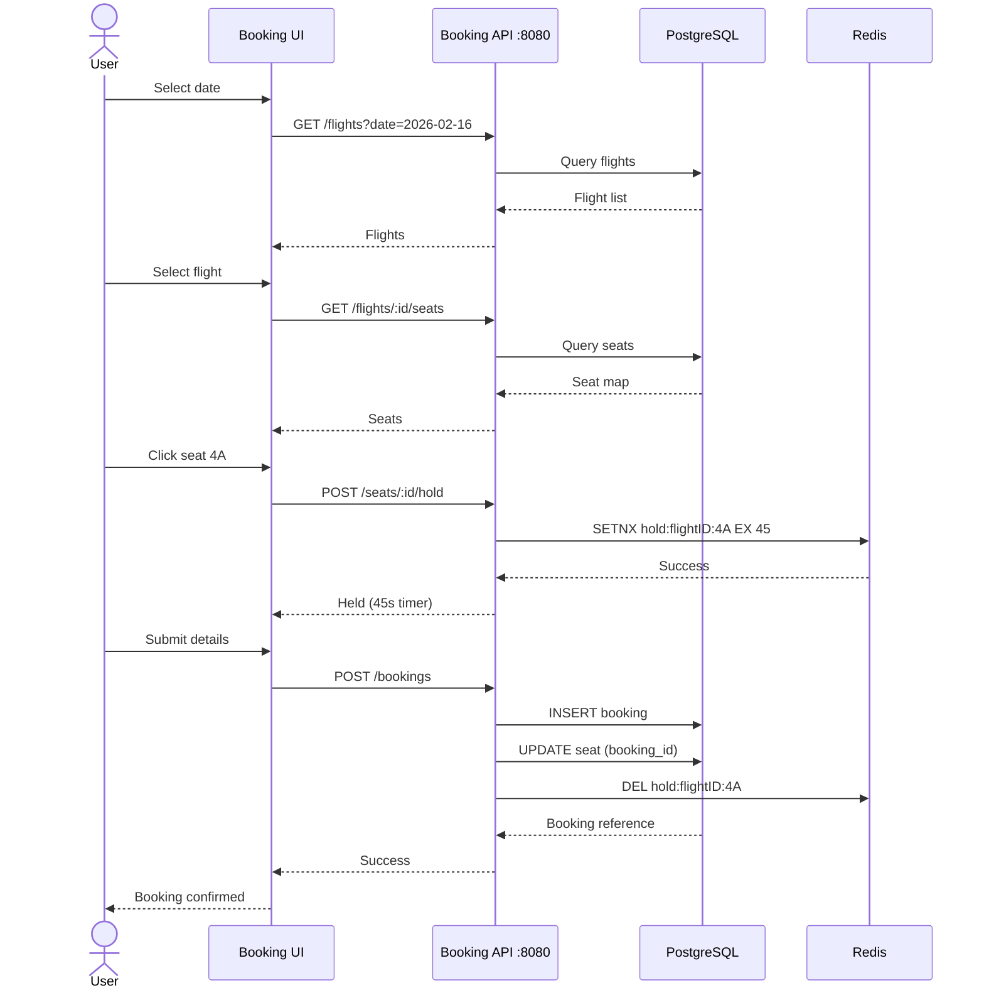
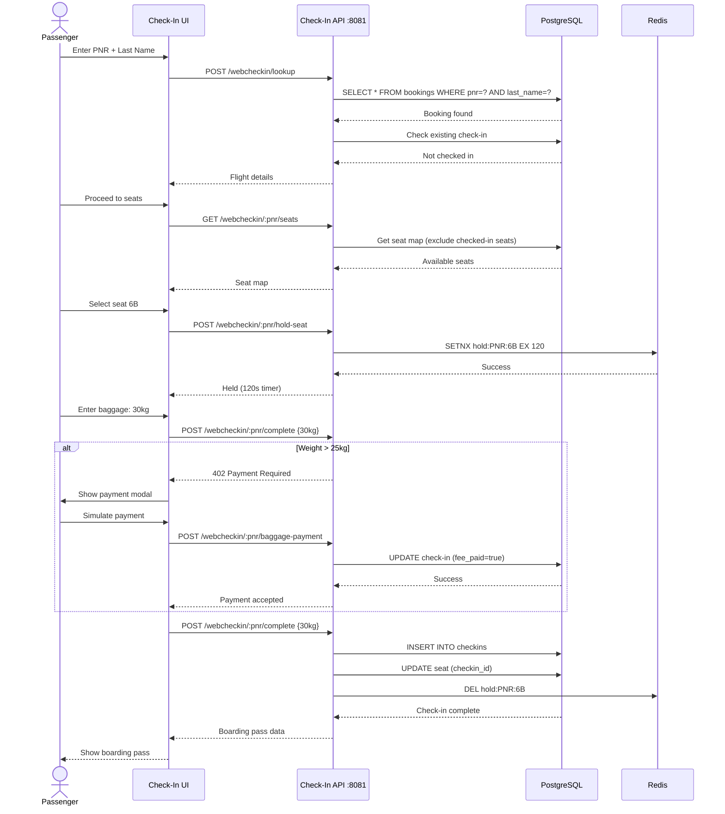

# System Architecture - Digital Check-In System

> **Version**: 2.0 (Dual System Architecture)  
> **Last Updated**: 2026-02-16

---

## System Overview

The Digital Check-In System now consists of **two independent subsystems** running on separate routes, sharing common infrastructure.

---

## High-Level Architecture

```text
+---------------------------------------------------------------------------------+
|                       User Interface (Frontend - React)                         |
|                                                                                 |
|                                 [Web Browser]                                   |
|                                       |                                         |
|                                       v                                         |
|    +-----------------------------------------------------------------------+    |
|    | Route: /                                                              |    |
|    |                        [Homepage Component]                           |    |
|    |                         [System Selector]                             |    |
|    +-----------------------------------------------------------------------+    |
|           | (Book Flight)                           | (Check-In)                |
|           v                                         v                           |
|  +-------------------------------+      +------------------------------------+  |
|  | Route: /flight-booking-system |      | Route: /web-check-in               |  |
|  |     [Flight Booking UI]       |      |       [Web Check-In UI]            |  |
|  | Date Picker -> Flight -> Seat |      | PNR Lookup -> Seat -> Boarding Pass|  |
|  +-------------------------------+      +------------------------------------+  |
+-------------------|-----------------------------------------|-------------------+
                    |                                         |
+-------------------|-----------------------------------------|-------------------+
|                   v             Backend Services            v                   |
|  +-------------------------------+      +------------------------------------+  |
|  | Booking Service :8080         |      | Check-In Service :8081             |  |
|  |      [Flight Booking API]     |      |        [Web Check-In API]          |  |
|  | - Search Flights              |      | - PNR Lookup                       |  |
|  | - Book Tickets                |      | - Seat Hold (120s)                 |  |
|  | - Seat Management             |      | - Complete Check-In                |  |
|  +-------------------------------+      +------------------------------------+  |
|            |          |                              |          |               |
+------------|----------|------------------------------|----------|---------------+
             |          |                              |          |
+------------|----------|-------- Data Layer -----------|----------|--------------+
|            |          |                              |          |               |
|            v          +---------------+    +---------+          v               |
|     [(PostgreSQL)]                    |    |                 [(Redis)]          |
|     - Flights                         v    v                 - Seat Holds       |
|     - Seats                        [Shared DB]               - TTL 45s (booking)|
|     - Bookings                                               - TTL 120s (check) |
|     - CheckIns                                                                  |
+---------------------------------------------------------------------------------+
```

---

## Component Details

### Frontend Architecture

```text
+---------------------------------------------------------------------------------+
|                              Frontend Components                                |
|                                                                                 |
|                        [main.jsx (React Router Setup)]                          |
|                                       |                                         |
|         +-----------------------------+-----------------------------+           |
|         |                             |                             |           |
| [Homepage.jsx]             [FlightBookingApp.jsx]         [WebCheckInApp.jsx]   |
|                                       |                             |           |
|                        +--------------+--------------+              |           |
|                        |              |              |              |           |
|                        v              v              v              |           |
|                  [FlightList]     [SeatMap]   [PassengerForm]       |           |
|                        |              |              |              |           |
|                        +--------------+--------------+              |           |
|                                       |                             |           |
|                                       |       +---------------------+---+       |
|                                       |       |          |          |   |       |
|                                       |       v          v          v   |       |
|                                       |  [PNRLookup] [FlightConf] [SeatMap]     |
|                                       |       |          |          |   |       |
|                                       |       |    +-----+----------+   |       |
|                                       |       |    |     |              |       |
|                                       |       v    v     v              v       |
|                                       | [BaggForm] [PayModal] [BoardingPass]    |
|                                       |       |    |     |              |       |
|                                       |       +----+-----+--------------+       |
|                                       v            |                            |
|                                 [Booking API]      v                            |
|                                              [Check-In API]                     |
+---------------------------------------------------------------------------------+
```

### Backend Microservices

```text
+----------------------------------------+     +----------------------------------------+
|      Booking Service (Port 8080)       |     |      Check-In Service (Port 8081)      |
|                                        |     |                                        |
|      [HTTP Handlers/Fiber Router]      |     |      [HTTP Handlers/Fiber Router]      |
|                   |                    |     |                   |                    |
|                   v                    |     |                   v                    |
|       [Business Logic Service]         |     |       [Business Logic Service]         |
| [Flight Search, Bookings Management]   |     |   [PNR Validation, Check-In Process]   |
|            |              |            |     |            |              |            |
|            v              v            |     |            v              v            |
|  [Repository Layer]  [Redis Client]    |     |  [Repository Layer]  [Redis Client]    |
|   (PostgreSQL DB)      (45s Hold)      |     |   (PostgreSQL DB)     (120s Hold)      |
+------------|--------------|------------+     +------------|--------------|------------+
             |              |                               |              |
             |              |                               |              |
             |              +-------------+   +-------------+              |
             |                            |   |                            |
             |                            v   v                            |
             |                     [(Shared Redis Cache)]                  |
             |                                                             |
             +----------------------------+   +----------------------------+
                                          |   |
                                          v   v
                                  [(Shared PostgreSQL DB)]
```

---

## Database Schema

### Entity Relationship Diagram



---

## Data Flow

### Flight Booking System (Existing)



### Web Check-In System (New)



---

## Infrastructure

### Docker Compose Configuration

```yaml
version: '3.8'

services:
  # Existing booking service
  booking-service:
    build: ./backend
    ports:
      - "8080:8080"
    environment:
      - DB_HOST=postgres
      - REDIS_HOST=redis
    depends_on:
      - postgres
      - redis
  
  # New check-in service
  checkin-service:
    build: ./backend_webcheckin
    ports:
      - "8081:8081"
    environment:
      - DB_HOST=postgres
      - REDIS_HOST=redis
    depends_on:
      - postgres
      - redis
  
  # Frontend (serves both systems)
  frontend:
    build: ./frontend
    ports:
      - "5173:5173"
    depends_on:
      - booking-service
      - checkin-service
  
  # Shared PostgreSQL
  postgres:
    image: postgres:15-alpine
    environment:
      POSTGRES_DB: skyhigh
      POSTGRES_USER: admin
      POSTGRES_PASSWORD: password
    volumes:
      - postgres_data:/var/lib/postgresql/data
  
  # Shared Redis
  redis:
    image: redis:7-alpine
    ports:
      - "6379:6379"

volumes:
  postgres_data:
```

---

## Technology Stack

| Layer | Technology | Version | Purpose |
|-------|-----------|---------|---------|
| **Frontend** | React | 18.x | UI framework |
| | React Router | 6.x | Client-side routing |
| | TailwindCSS | 3.x | Styling |
| | Vite | 5.x | Build tool |
| **Backend** | Go | 1.21+ | Primary language |
| | Fiber | 2.x | HTTP framework |
| | GORM | 1.x | ORM |
| **Database** | PostgreSQL | 15.x | Relational data |
| | Redis | 7.x | Caching & seat holds |
| **DevOps** | Docker | 24.x | Containerization |
| | Docker Compose | 2.x | Orchestration |

---

## Deployment Architecture

```text
+-----------------------------------------------------------------------------------+
|                             Production Environment                                |
|                                                                                   |
|                                 [Load Balancer]                                   |
|                                    (NGINX)                                        |
|                                   /       \                                       |
|                                  /         \                                      |
|                                 v           v                                     |
|  +-----------------------------------------------------------------------------+  |
|  |                             Frontend Tier                                   |  |
|  |                                                                             |  |
|  |           [Frontend Instance 1]             [Frontend Instance 2]           |  |
|  +-----------------|---------------------------------|-------------------------+  |
|                    |                                 |                            |
|  +-----------------|---------------------------------|-------------------------+  |
|  | Backend Tier    |                                 |                         |  |
|  |        +--------v-------+                +--------v-------+                 |  |
|  |        | Booking Service|                |Check-In Service|                 |  |
|  |    +---v---+        +---v---+        +---v---+        +---v---+             |  |
|  |    | BS 1  |        | BS 2  |        | CS 1  |        | CS 2  |             |  |
|  |    +-------+        +-------+        +-------+        +-------+             |  |
|  |      |   |            |   |            |   |            |   |               |  |
|  +------|---|------------|---|------------|---|------------|---|---------------+  |
|         |   |            |   |            |   |            |   |                  |
|  +------|---|------------|---|------------|---|------------|---|---------------+  |
|  | Data |   |            |   |            |   |            |   |               |  |
|  | Tier |   +--------+   |   +--------+   |   +--------+   |   +--------+      |  |
|  |      v            |   v            |   v            |   v            |      |  |
|  | [(PG Primary)]    | [(PG Replica)] | [(PG Primary)] | [(PG Replica)] |      |  |
|  |                   v                v                v                v      |  |
|  |                   +--------------------------------------------------+      |  |
|  |                                  [(Redis Cluster)]                          |  |
|  +-----------------------------------------------------------------------------+  |
+-----------------------------------------------------------------------------------+
```

---

## Security Considerations

| Concern | Mitigation |
|---------|------------|
| **PNR Enumeration** | Rate limiting (5 attempts/minute/IP) |
| **SQL Injection** | GORM parameterized queries |
| **XSS** | React auto-escaping, CSP headers |
| **CORS** | Whitelist frontend origin only |
| **Seat Hold Abuse** | Redis TTL enforcement, IP-based limits |
| **Payment Fraud** | Simulated for MVP, integrate payment gateway for production |

---

## Monitoring & Observability

```text
+--------------------+       +------------------------------------+
|                    | ----> |       Application Metrics          |
| [Booking Service]  |       |   [Prometheus] ---> [Grafana]      |
|                    |       +------------------------------------+
|                    |
|                    |       +------------------------------------+
|                    | ----> |             Logging                |
|                    |       | [App Logs] --> [ELK Stack (Kibana)]|
+--------------------+       +------------------------------------+
         |
         |                   +------------------------------------+
+--------------------+ ----> |             Tracing                |
| [Check-In Service] |       |            [Jaeger]                |
|                    |       +------------------------------------+
|                    | ----> (To Logs)
|                    |
|                    | ----> (To Prometheus)
+--------------------+
```

**Key Metrics to Monitor:**
- Request latency (P50, P95, P99)
- Seat hold expiry rate
- Check-in completion rate
- Database connection pool usage
- Redis memory usage
- Error rates by endpoint

---

## Scalability Considerations

### Horizontal Scaling
- **Frontend**: Stateless, scale to N instances behind load balancer
- **Backend Services**: Stateless, scale independently based on load
- **Database**: Read replicas for GET requests, primary for writes
- **Redis**: Cluster mode for high availability

### Performance Optimization
- **Seat Map Caching**: Cache seat maps in Redis (1-minute TTL)
- **Database Indexing**: 
  - `bookings(pnr)` - For fast PNR lookup
  - `checkins(booking_id)` - For check-in status queries
  - `seats(flight_id, status)` - For seat availability
- **Connection Pooling**: Max 50 connections per service instance

---

## Disaster Recovery

| Scenario | Recovery Strategy | RTO | RPO |
|----------|------------------|-----|-----|
| Database Failure | Failover to replica | 30s | 0 (synchronous replication) |
| Redis Failure | Rebuild holds from DB | 1min | 0 (seats in DB) |
| Service Crash | Auto-restart (Docker) | 10s | 0 |
| Data Center Outage | Multi-region deployment | 5min | 1min |

---

## Future Enhancements

1. **Real Payment Integration**: Stripe/PayPal for baggage fees
2. **Mobile Apps**: React Native iOS/Android apps
3. **Boarding Pass PDF**: Generate downloadable PDFs
4. **Email Notifications**: Send boarding pass via email
5. **SMS Reminders**: Check-in reminders 24h before flight
6. **Kiosk Mode**: Dedicated UI for airport kiosks
7. **Admin Dashboard**: Monitor check-ins, override holds

---

**Document Version**: 2.0  
**Last Review**: 2026-02-16  
**Next Review**: 2026-03-01
